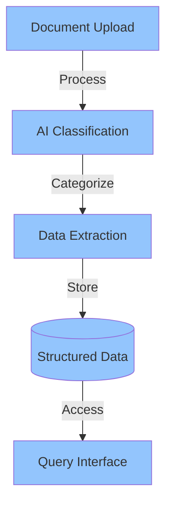
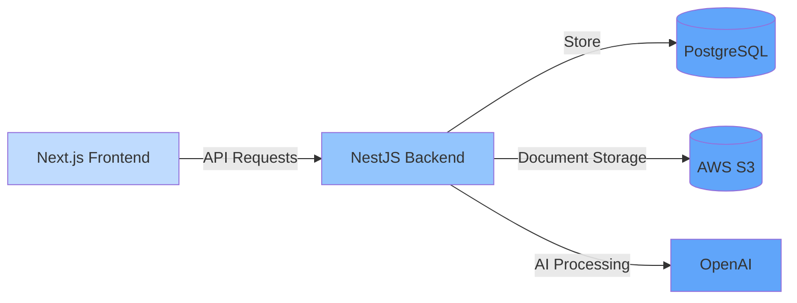

# ClearLedger

<div align="center">
  <h3>Your AI-Powered Financial Document Management Solution</h3>
</div>

## 🌟 Overview

ClearLedger is an intelligent financial document management system that simplifies the organization and analysis of financial documents. Using advanced AI technology, it automatically processes, categorizes, and extracts information from receipts, card statements, and invoices, making financial data management effortless and efficient.



## ✨ Key Features

- **Intelligent Document Processing**: Automatically classify and process financial documents
- **Data Extraction**: Extract and structure information from various document types
- **Natural Language Queries**: Ask questions about your financial data in plain English
- **Secure Storage**: Enterprise-grade security for your sensitive financial information
- **Interactive Dashboard**: Visualize and analyze your financial data

## 🏗️ Architecture

The project is split into two main components:

1.  **Frontend**: Next.js application providing the user interface
2.  **Backend**: NestJS API handling document processing and data management



## 🚀 Quick Start

1.  Clone the repository:

```bash
git clone https://github.com/yourusername/clearledger.git
cd clearledger`
```

2.  Set up the backend:

```bash
cd backend
cp .env.example .env
npm  install`
```

3.  Set up the frontend:

```bash
cd frontend
cp .env.example .env.local
npm  install`
```

4.  Start the development servers:

```bash
# In backend directory npm run start:dev
# In frontend directory npm run dev`
```

## 🔐 Security

ClearLedger implements several security measures:

- API Key Authentication
- Secure File Upload
- AWS S3 Encryption
- Database Security

## 📚 Read More

- [Client](./client-master/README.md)
- [Server](./server-master/README.md)
