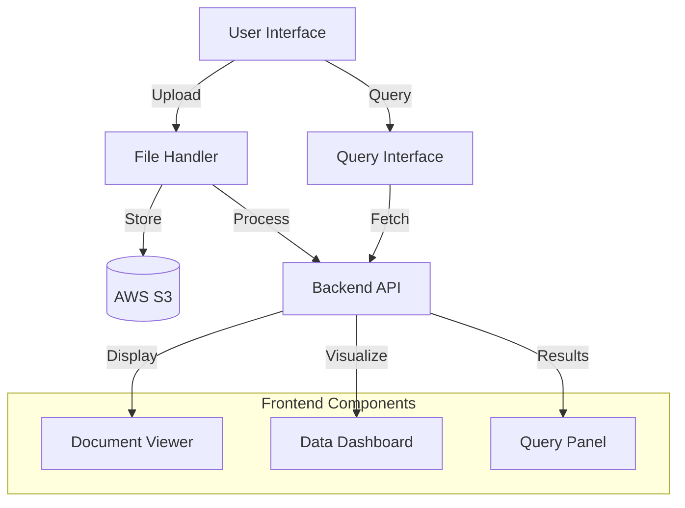
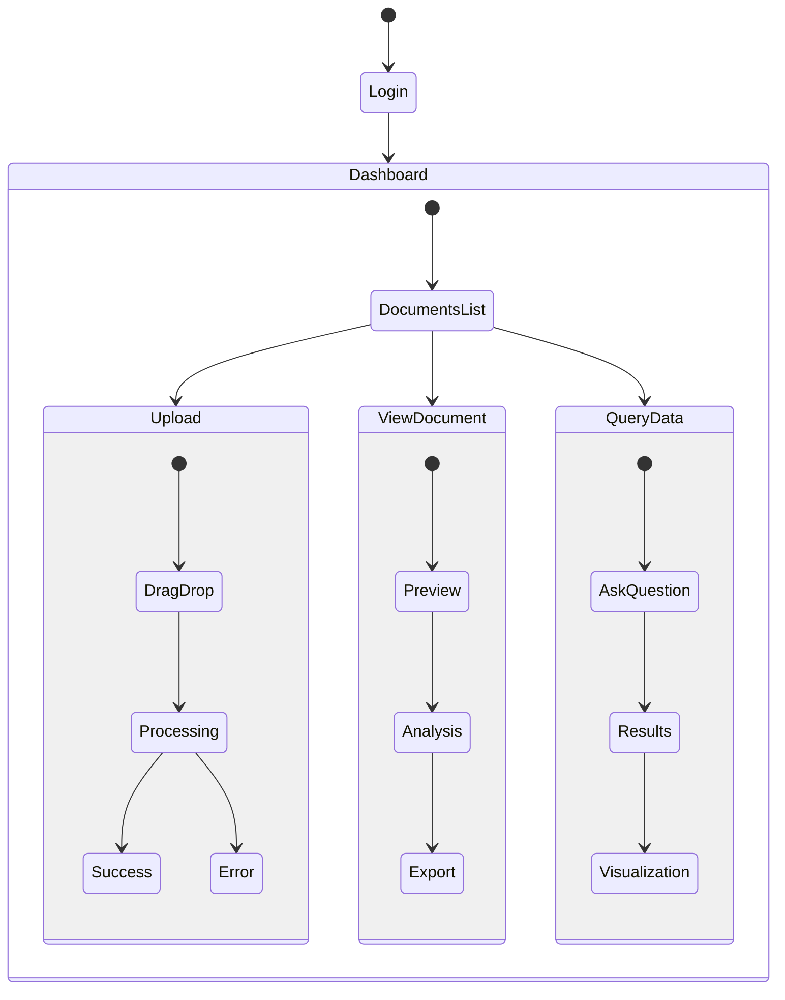

# ClearLedger Frontend

A Next.js-based web application for managing and analyzing financial documents. This application provides an intuitive interface for document upload, visualization, and querying of financial information.

## 🏗️ Architecture



## ✨ Features

- **Drag & Drop Upload**: Easy document upload interface
- **Document Preview**: Built-in PDF viewer
- **Interactive Dashboard**: Visual representation of financial data
- **Natural Language Queries**: Ask questions about your documents
- **Responsive Design**: Works on desktop and mobile devices
- **Real-time Updates**: Instant feedback on document processing

## 🛠️ Tech Stack

- **Framework**: Next.js 13+ with App Router
- **Styling**: Tailwind CSS
- **State Management**: Zustand
- **Forms**: React Hook Form with Zod validation
- **Authentication**: NextAuth.js
- **Storage**: AWS S3
- **Charts**: Recharts

## 🚀 Getting Started

1.  **Prerequisites**

    ```bash
    `node  >=  16.x`
    ```

2.  **Environment Setup**
    //.env.example # Database Configuration
    POSTGRES_URL=your_postgres_url
    POSTGRES_PRISMA_URL=your_prisma_url
    POSTGRES_URL_NON_POOLING=your_non_pooling_url
    POSTGRES_USER=your_username
    POSTGRES_HOST=your_host
    POSTGRES_PASSWORD=your_password
    POSTGRES_DATABASE=your_database

        # Authentication
        NEXTAUTH_URL=http://localhost:3000
        NEXTAUTH_SECRET=your_secret

        # AWS S3
        S3_ACCESS_KEY_ID=your_access_key
        S3_SECRET_ACCESS_KEY=your_secret_key
        S3_BUCKET=your_bucket
        S3_REGION=your_region
        S3_ENDPOINT=your_endpoint

        # API Keys
        OPENAI_API_KEY=your_openai_key
        X_API_KEY=1234

3.  **Installation**

    ```bash
    	npm  install
    ```

4.  **Development**

    ```bash
    `npm run dev`
    ```

## 📱 User Interface Flow



## 🔒 Security

- Secure file upload
- Authentication with NextAuth.js
- Input validation with Zod
- Secure AWS S3 access
