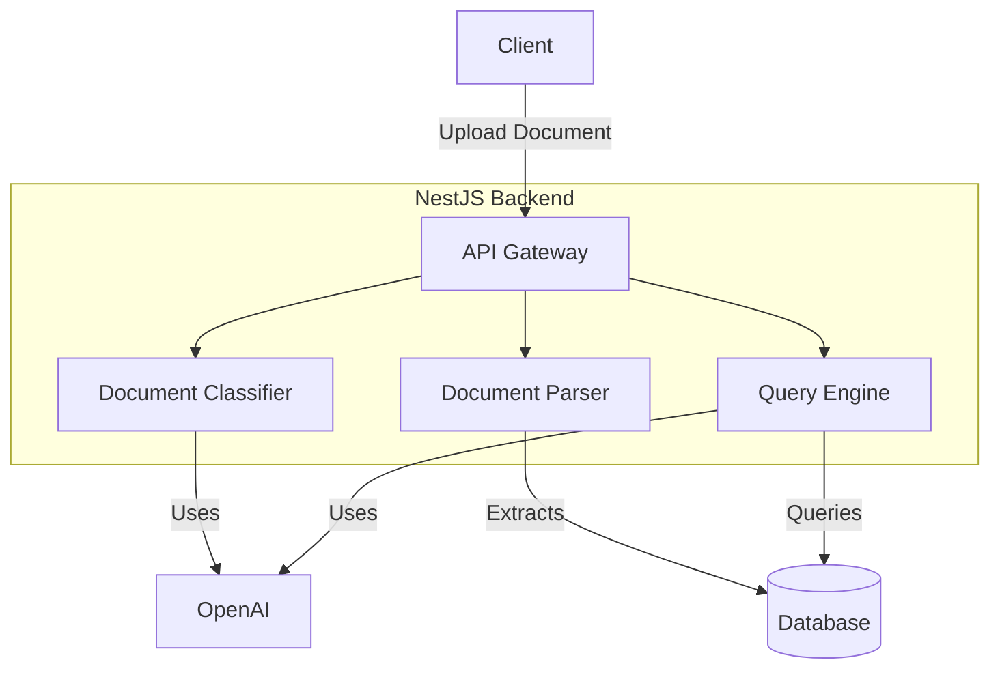
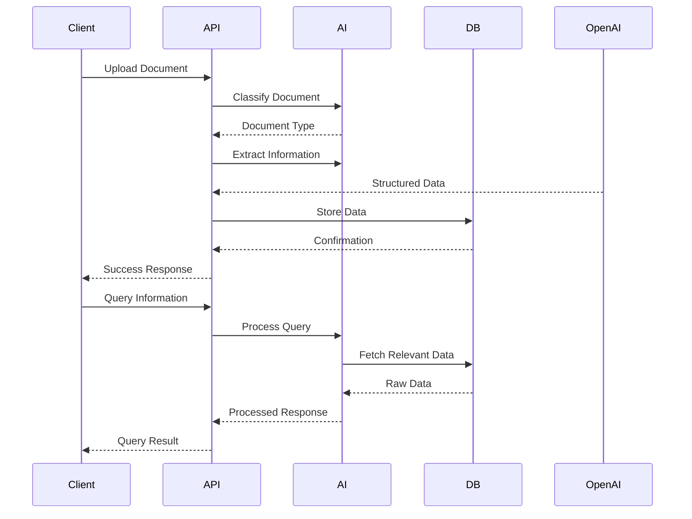

# ClearLedger Backend

A NestJS-based backend service for processing and analyzing financial documents using AI. This service handles document classification, information extraction, and provides a query interface for processed financial data.

## 🏗️ Architecture



## 🚀 Features

-   **Document Classification**: Automatically identifies document types (receipts, card statements, invoices)
-   **Information Extraction**: Processes documents to extract structured financial data
-   **Query Interface**: Natural language querying of processed documents
-   **Security**: API key authentication and rate limiting


## 🛠️ Tech Stack

-   **Framework**: NestJS
-   **Database**: PostgreSQL with Prisma ORM
-   **AI Integration**: LangChain & OpenAI
-   **PDF Processing**: Poppler
-   **Container**: Docker

## 🏃‍♂️ Getting Started

1.  **Prerequisites**
    
    ```bash
    `node  >=  16.x docker`
    ```


    
2.  **Environment Setup**
    
    ```bash    
    `cp .env.example .env`
    ```
    Key environment variables:
    
    

    ```bash
    //.env
    
    `NODE_ENV = development 
    POSTGRES_HOST = localhost 
    POSTGRES_USER = postgres 
    POSTGRES_PORT = 5433 
    POSTGRES_PASSWORD = root 
    POSTGRES_DB = clear-ledger 
    POPPLER_BIN_PATH = /opt/homebrew/bin 
    OPENAI_API_KEY = your_openai_key`
    ```
3.  **Installation**
    
	```bash
	npm  install
	```
    
4.  **Database Setup**
    
	   ```bash
    docker-compose up -d 
    npx prisma generate 
    npx prisma migrate dev`
	```
    
5.  **Running the App**
    
	   ```bash    
	    # development 
	    npm run start:dev   
	    # production 
	    npm run build 
	    npm run start:prod
	```



## 🔒 Security

-   API Key Authentication
-   Helmet Security Headers
-   Input Validation


## 🐳 Docker

```bash
`# Build the image 
docker build -t clear-ledger-app .   
#Run the container 
docker run -p 3000:3000 clear-ledger-app`
```

